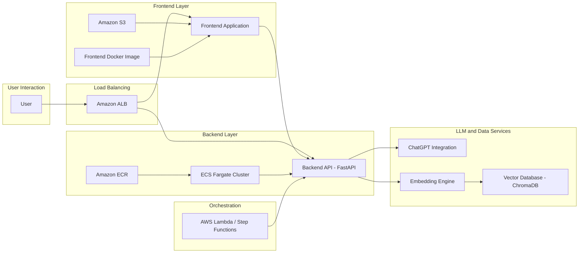

# Sports Talk Application

## Table of Contents

- [Overview](#overview)
- [Features](#features)
- [Prerequisites](#prerequisites)
- [Installation](#installation)
  - [Backend API and Crawler](#backend-api-and-crawler)
  - [Frontend](#frontend)
- [Docker Setup](#docker-setup)
- [Kubernetes Deployment](#kubernetes-deployment)
  - [Using Kubernetes Manifests](#using-kubernetes-manifests)
  - [Using Terraform for AWS Deployment](#using-terraform-for-aws-deployment)
- [Crawler Workflow](#crawler-workflow)
- [LLM Integration](#llm-integration)
- [Troubleshooting](#troubleshooting)
- [Contributing](#contributing)
- [License](#license)

## Overview

The **Sports Talk Application** is an advanced solution that leverages Language Learning Models (LLMs) to provide expert-level insights within the sports domain. With a Retrieval-Augmented Generation (RAG) architecture, the application combines efficient document retrieval, embedding, and ChatGPT-3.5 integration to deliver accurate and contextually rich responses.

**Key Components:**
- **Crawler (SportsDBCrawler):** Periodically scrapes and updates player data stored in `players.json`.
- **Embedding Engine:** Converts text into high-dimensional embeddings for similarity searches.
- **Vector Database (ChromaDB):** Stores embeddings to enable fast document retrieval.
- **Backend API (FastAPI):** Serves as the interface for processing user queries and retrieving responses.
- **LLM Integration (ChatGPT-3.5):** Enhances responses by combining LLM capabilities with retrieved documents.
- **Frontend (React, TypeScript, Vite):** Provides an interactive chat interface for users.
- **Containerization (Docker):** Packages the application components in reproducible environments.
- **Orchestration (Kubernetes with Terraform):** Manages deployment and scaling of containerized services.

## Features

- **Expert-Level Responses:** Leverages ChatGPT-3.5 to deliver detailed and accurate sports-related answers.
- **Retrieval-Augmented Generation (RAG):** Integrates document retrieval with LLM processing for enhanced output.
- **Efficient Data Retrieval:** Uses vector embeddings and ChromaDB for rapid similarity searches.
- **Scalable Infrastructure:** Deploys using containerization and Kubernetes for high availability.
- **Automated Deployment:** Utilizes Terraform and Docker for consistent and reproducible cloud deployments.
- **Extensible Architecture:** Designed for future expansion to include additional data sources and functionalities.

## Architecture (when deploy to AWS)

## Prerequisites

Before setting up the application, ensure you have the following installed:

- Python 3.10 or higher
- pip (Python package manager)
- Node.js and npm or yarn (for the frontend)
- Docker
- Kubernetes and kubectl (for container orchestration)
- Terraform (for Infrastructure as Code)
- AWS CLI (if deploying on AWS)

## Installation

### Backend API and Crawler

1. **Clone the Repository:**

~~~bash
git clone https://github.com/yourusername/sports-talk-app.git
cd sports-talk-app
~~~

2. **Setup Virtual Environment:**

~~~bash
python -m venv venv
source venv/bin/activate   # Unix/Mac
venv\\Scripts\\activate    # Windows
~~~

3. **Install Python Dependencies:**

~~~bash
pip install -r requirements.txt
~~~

4. **Run the Crawler to Update Data:**

This command scrapes player data and updates `players.json`:

~~~bash
python -m app.scrapers.sportsdb
~~~

5. **Start the Backend API:**

Launch the FastAPI application:

~~~bash
uvicorn main:app --reload --host 0.0.0.0 --port 8000
~~~

Access the API documentation at [http://localhost:8000/docs](http://localhost:8000/docs).

### Frontend

1. **Navigate to the Frontend Directory:**

~~~bash
cd frontend
~~~

2. **Install Dependencies:**

Using npm:

~~~bash
npm install
~~~

Or with yarn:

~~~bash
yarn
~~~

3. **Run the Development Server:**

Start the frontend development server:

~~~bash
npm run dev
~~~

The chat interface will be available at [http://localhost:5173](http://localhost:5173).

## Docker Setup

### Building the Docker Images

- **Backend Dockerfile (located in the project root):**

~~~dockerfile
FROM python:3.10-slim
WORKDIR /app
COPY requirements.txt .
RUN pip install --no-cache-dir -r requirements.txt
COPY . .
EXPOSE 8000
CMD ["uvicorn", "main:app", "--host", "0.0.0.0", "--port", "8000"]
~~~

Build the backend image:

~~~bash
docker build -t sports-talk-app:latest .
~~~

- **Frontend Dockerfile (located in frontend/Dockerfile):**

~~~dockerfile
FROM node:16-alpine as build
WORKDIR /app
COPY package.json yarn.lock ./
RUN yarn install
COPY . .
RUN yarn build

FROM nginx:alpine
COPY --from=build /app/dist /usr/share/nginx/html
EXPOSE 80
CMD ["nginx", "-g", "daemon off;"]
~~~

Build the frontend image:

~~~bash
cd frontend
docker build -t sports-talk-frontend:latest .
~~~

### Running Containers

- **Run Backend Container:**

~~~bash
docker run -d -p 8000:8000 --name sports-talk-backend sports-talk-app:latest
~~~

- **Run Frontend Container:**

~~~bash
docker run -d -p 80:80 --name sports-talk-frontend sports-talk-frontend:latest
~~~

## Kubernetes Deployment

You have two deployment options: using Kubernetes manifests or Terraform for AWS deployment.

### Using Kubernetes Manifests

#### Backend Deployment (k8s/backend-deployment.yaml)

~~~yaml
apiVersion: apps/v1
kind: Deployment
metadata:
  name: backend-deployment
  namespace: sports-talk
spec:
  replicas: 2
  selector:
    matchLabels:
      app: backend
  template:
    metadata:
      labels:
        app: backend
    spec:
      containers:
      - name: backend
        image: sports-talk-app:latest
        ports:
        - containerPort: 8000
~~~

#### Backend Service (k8s/backend-service.yaml)

~~~yaml
apiVersion: v1
kind: Service
metadata:
  name: backend-service
  namespace: sports-talk
spec:
  selector:
    app: backend
  ports:
    - protocol: TCP
      port: 80
      targetPort: 8000
  type: LoadBalancer
~~~

#### Frontend Deployment (k8s/frontend-deployment.yaml)

~~~yaml
apiVersion: apps/v1
kind: Deployment
metadata:
  name: frontend-deployment
  namespace: sports-talk
spec:
  replicas: 1
  selector:
    matchLabels:
      app: frontend
  template:
    metadata:
      labels:
        app: frontend
    spec:
      containers:
      - name: frontend
        image: sports-talk-frontend:latest
        ports:
        - containerPort: 80
~~~

#### Frontend Service (k8s/frontend-service.yaml)

~~~yaml
apiVersion: v1
kind: Service
metadata:
  name: frontend-service
  namespace: sports-talk
spec:
  selector:
    app: frontend
  ports:
    - protocol: TCP
      port: 80
      targetPort: 80
  type: LoadBalancer
~~~

Apply all manifests:

~~~bash
kubectl apply -f k8s/ -n sports-talk
kubectl get pods -n sports-talk
kubectl get services -n sports-talk
~~~

### Using Terraform for AWS Deployment

Below is a simplified Terraform snippet to provision an ECS cluster with Fargate:

~~~hcl
provider "aws" {
  region = "us-east-1"
}

module "vpc" {
  source  = "terraform-aws-modules/vpc/aws"
  version = "3.14.2"
  name    = "sports-talk-vpc"
  cidr    = "10.0.0.0/16"
  azs             = ["us-east-1a", "us-east-1b"]
  public_subnets  = ["10.0.1.0/24", "10.0.2.0/24"]
  private_subnets = ["10.0.101.0/24", "10.0.102.0/24"]
  enable_nat_gateway = true
}

resource "aws_ecs_cluster" "sports_talk_cluster" {
  name = "sports-talk-cluster"
}

# Additional ECS Task Definitions, Services, ALB, and IAM roles would be added here.
~~~

Deploy the infrastructure:

~~~bash
terraform init
terraform plan
terraform apply
~~~

## Crawler Workflow

The **SportsDBCrawler** is responsible for extracting player data and updating `players.json`. The workflow includes:

1. **Initialization:** Setting up paths and loading existing data.
2. **Data Crawling:** Fetching data from sports websites and extracting player information.
3. **Data Processing:** Parsing, logging, and error management.
4. **Data Storage:** Updating `players.json` with fresh, reliable information.

## LLM Integration

The application uses a Retrieval-Augmented Generation (RAG) method for LLM integration:

1. **Document Retrieval:** Embeddings are generated from crawled data and stored in ChromaDB.
2. **Query Processing:** User queries are processed by the backend API.
3. **Response Generation:** ChatGPT-3.5 uses retrieved documents to generate detailed responses.
4. **Continuous Learning:** The system periodically refreshes embeddings to improve accuracy.

## Troubleshooting

- **Crawler issues:** 
  - Verify write permissions for the data directories.
  - Check logs for HTTP request or parsing errors.
  - Confirm the JSON structure in `players.json` remains valid.

- **API errors:** 
  - Investigate backend logs.
  - Ensure `players.json` is populated with the correct data.

- **Deployment issues:** 
  - Review Docker build logs for errors.
  - Ensure Kubernetes manifests or Terraform configurations are correctly applied.

## Contributing

Contributions are welcome! Follow these steps:

1. **Fork the Repository:**
   - Click the "Fork" button on the repository page.

2. **Clone Your Fork:**

~~~bash
git clone https://github.com/yourusername/sports-talk-app.git
cd sports-talk-app
~~~

3. **Create a Feature Branch:**

~~~bash
git checkout -b feature/your-feature
~~~

4. **Commit and Push Your Changes:**

~~~bash
git commit -am "Add new feature"
git push origin feature/your-feature
~~~

5. **Submit a Pull Request:** Provide a detailed description of your changes.

## License

This project is licensed under the MIT License.
"""